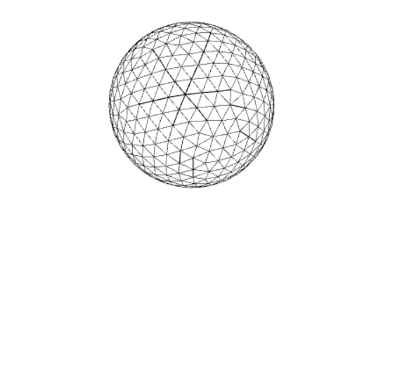
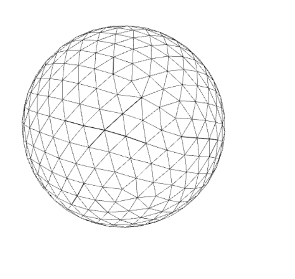

# SurfaceGeometry

Library for triangular surface mesh generation, stabilisation and surface parameter estimation. It is intended to be used as surface velocity integrator for boundary element method, so I it also includes vertex normal, curvature calculation and also circulators. 

# Possible future directions

- Make a mesher algorithm from Meshing.jl marching cubes and remesh that with ElTopo and minimization of elastic surface energy.
- Implement iterators and mesh operations with edge based data structure (possibly usefull EvolvingGraphs and LightGraphs).

# Mesh Utils

To obtain finer mesh a `subdivision` method can be used. Positions of the new introduced edge nodes can be calculated either by interpolation which can be pushed to real surface if signed distance function is given as argument. The interface for the function 
```
# creates only reffined topology of faces as rfaces
rfaces = subdivision(faces)
# subdivide and calculate positions of new nodes with linear or paraboloid interpolation 
rponts, rfaces = subdivision(points,faces,method=:linear)
rponts, rfaces = subdivision(points,faces,method=:paraboloid)
# subdivide surface with linear interpolation and push nodes (gradient decent) to the real surface
rponts, rfaces = subdivision(points,faces,x -> x[1]^2 + x[2]^2 + x[3]^2 - 1)
```

## Estimation of surface parameters

For calculation of vertex normals and mean curvature functions `NormalVectors!` and `MeanCurvatures` are created. A basic interface to them is
```
n = Array(size(points)...)
NormalVectors!(n,points,faces,i->FaceVRing(i,faces))

curvatures = Array(size(points,2))
MeanCurvatures!(curvatures,points,faces,n,i->FaceVRing(i,faces))
```
where in the arguments `VertexVRing` and `FaceVRring` are vertex and face circulators discoussed more in next section. 

For surface global parameters use function `volume(points,faces)`, for prolate ellipsoid fit of the points use `FitEllipsoid(points)`.

## Data structure and circulators

Circulators are iterators which read mesh topology (for example `faces`) and ansver the questions such as which verticies are directly connected to given vertex, which traingular faces has common vertex. The vertex circulator `VertexVRing`, face circulator `FaceVRing` and oposite edge circulator `DoubleVertexVRing` can be used as follows
```
vertex = 1
for i in VertexVRing(vertex,faces)
    println("This is vertex $i")
end

for i in FaceVRing(vertex,faces)
    println("This is face $i which has common vertex $vertex")
end

for (v1,v2) in DoubleVertexVring(vertex,faces)
    println("The oposite edge to $vertex in counterclockwise direction is $v1 $v2")
end 
```

The circulators above uses seach over face elements, which in some cases are too slow. Instead you can save all searches beforehand in data structure. For example you can initialise face based data structure and use all previuos circulator functions
```
dataStructure = FaceBasedDS(faces)

vertex = 1
for i in VertexVRing(vertex,dataStructure)
    println("This is vertex $i")
end
```
Or you can choose connectivity data structure which for me have prooven to be by a facor of 10 faster
```
valence = 7
dataStructure = ConnectivityDS(faces,valence)
```

## Surface velocity field stabilisation

Assuming that velocity function is given as `velocity(t,points,faces)` the integration for points with Euler method would look like
```
t = 0
h = 0.1
p = points

for i in 1:10
    v = velocity(t,p,faces)
    p += h*v
end 
```
In this way it is however more likely to experience the degeneration of triangles as surface evolves. To deal with it we can adjust tangential velocity for keeping a good mesh or also making topology changes.

Here we use "kinetic" energy minimization function similar to [Zinchenko1997] and [Zinchenko2013]


which when minimized for tangential velocities keeps mesh good at next time step. To use this stabilisation algorithm for your surface evolution incoorporate it in your integrator as follows:
```
t = 0
h = 0.1
p = points

for i in 1:10
    v = velocity(t,p,faces)

    res =  stabilise(points,faces,v)
    println("Energy before minimization Finit=$(res.Finit) after Fres=$(res.Fres)")
    v = res.vres
    
    p += h*v
end 
```
Enright (incompressable velocity field proposed in [Enright]]) test is being used for checking the need for stabilisation:

|  |  |  |
|---|---|---|
| Evolution of original velocity field | Evolution if only normal component of the velocity field is kept | Evolution with stabilised velocity |


